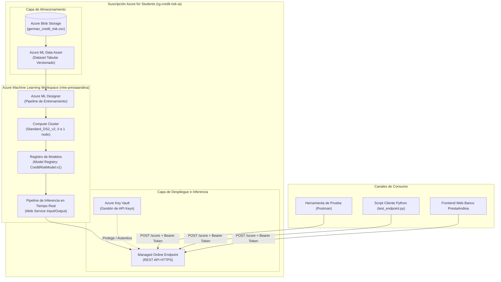

# Microproyecto 3: Sistema de Evaluación de Riesgo Crediticio en Tiempo Real con Azure Machine Learning

**Asignatura:** Computación en la Nube  
**Docente:** Prof. Oscar H. Mondragón  
**Integrantes del Equipo:**  
* Julio Cesar Rosero Porras  
* Karoll Dahian Ramirez Marulanda  
* Jose Fernando Luque Cajiao  
**Caso de Estudio:** Evaluación y Clasificación de Riesgo Crediticio (*Credit Risk Assessment*)  
**Empresa Ficticia:** Banco Digital PrestaAndina S.A.  
**Plataforma Cloud:** Microsoft Azure (Azure Machine Learning Studio / Designer)  

---

## 1. Análisis de los Requerimientos (20%)

### 1.1. Descripción de la Empresa y sus Necesidades
**Banco Digital PrestaAndina S.A.** es una entidad de tecnología financiera (*FinTech*) de base digital que otorga microcréditos de libre destino y préstamos de consumo en línea a personas naturales y microempresarios.

#### Situación Actual y Problemática:
1. **Alta tasa de mora (Default):** La cartera vencida se ubica en el 14.8%, debido a que la evaluación crediticia se realiza mediante reglas empíricas estáticas y revisión manual por analistas de crédito.
2. **Latencia en la respuesta al cliente:** El análisis manual toma entre 24 y 48 horas por solicitud, provocando una tasa de abandono del 35% de los solicitantes hacia competidores con desembolso inmediato.
3. **Escasez de trazabilidad y gobernanza de modelos:** No existe un entorno formal para reentrenar algoritmos con datos recientes ni para versionar los modelos según directrices de auditoría bancaria.

#### Necesidad del Negocio:
Implementar una solución de Inteligencia Artificial en la nube capaz de predecir en tiempo real (menos de 2 segundos) la probabilidad de incumplimiento de pago (*Credit Risk = Bad*) de un solicitante a partir de su historial financiero y variables sociodemográficas, integrándose con el portal web del banco mediante una API REST segura.

---

### 1.2. Definición de Requerimientos y Restricciones

#### Requerimientos Funcionales (RF):
* **RF-01 (Ingesta y Almacenamiento Seguro):** Ingestar y almacenar el histórico de 1,000 operaciones crediticias consolidadas con variables financieras y de comportamiento.
* **RF-02 (Pipeline de Preprocesamiento y Entrenamiento):** Automatizar el flujo de selección de variables, limpieza, división estratificada (70% entrenamiento / 30% validación) y entrenamiento de modelos de clasificación supervisada.
* **RF-03 (Evaluación Comparativa):** Evaluar el desempeño de modelos predictivos mediante métricas robustas (ROC/AUC, Matriz de Confusión, Precisión, Recall y F1-Score). La meta mínima es un AUC >= 0.75.
* **RF-04 (Inferencia en Tiempo Real):** Exponer el modelo ganador como un Endpoint REST HTTPS accesible con clave de autorización (*API Key*).
* **RF-05 (Consumo Interactivo):** Recibir solicitudes en formato JSON y devolver la clasificación (`Good` o `Bad`) y la probabilidad calculada.

#### Requerimientos No Funcionales (RNF):
* **RNF-01 (Latencia):** El tiempo de respuesta de la inferencia debe ser inferior a 2.5 segundos por transacción.
* **RNF-02 (Elasticidad y Ahorro):** Los recursos de cómputo deben escalar a cero (0 nodos) cuando no haya tareas de entrenamiento activas para evitar costos ociosos.
* **RNF-03 (Seguridad):** Tráfico cifrado mediante TLS 1.2+ y autenticación en los endpoints mediante llaves gestionadas en Azure Key Vault.

#### Restricciones del Proyecto:
* **Presupuesto Estudiantil:** Cada integrante dispone de un crédito limitado de **$50 USD** en *Azure for Students*. Se prohíbe el aprovisionamiento de máquinas virtuales con GPU (familias NC/NV) y el uso de instancias encendidas permanentemente.
* **Cuotas de Cómputo:** Restricción a CPUs de propósito general de bajo costo (`Standard_DS2_v2` o `Standard_DS11_v2`, máximo 2 vCPUs).
* **Cumplimiento y Privacidad:** Anonimización de datos sensibles de solicitantes (remoción de identificadores personales únicos).

---

### 1.3. Generación y Selección de Alternativas de Solución

| Criterio de Comparación | Alternativa 1: IaaS Manual (VM Ubuntu + Script Python) | Alternativa 2: Azure ML Designer / Studio (PaaS Seleccionada) | Alternativa 3: Servicio SaaS Cerrado (Cognitive Services genérico) |
| :--- | :--- | :--- | :--- |
| **Tiempo de Implementación** | Alto (requiere configurar Docker, Nginx, Flask, dependencias de Python). | **Muy Rápido (diseño visual drag-and-drop y despliegue en 1 clic).** | Rápido, pero rígido. |
| **Gobernanza y MLOps** | Nula (versionamiento manual de archivos `.pkl` o `.joblib`). | **Nativa (registro formal de modelos, linaje de datos y métricas).** | Opaca (caja negra sin control del algoritmo). |
| **Control de Costos ($50 USD)** | Riesgoso (si la VM queda encendida 24/7 gasta el crédito). | **Óptimo (Compute Clusters escalan automáticamente a 0 nodos).** | Pago por transacción, sin control granular de infraestructura. |
| **Auditabilidad Bancaria** | Requiere programar manualmente matrices de confusión y curvas ROC. | **Módulos visuales integrados de evaluación de modelos.** | Limitada a las salidas estándar del proveedor. |
| **Decisión Final** | Descartada por complejidad operativa y riesgo de cobros indeseados. | **SELECCIONADA: Máxima reproducibilidad, bajo costo y cumplimiento estricto de la rúbrica.** | Descartada por no permitir personalización del pipeline ni algoritmos propios. |

---

### 1.4. Propuesta del Pipeline de Azure Machine Learning
De acuerdo con la [referencia oficial de componentes de Azure ML Designer](https://learn.microsoft.com/es-es/azure/machine-learning/component-reference/component-reference), el pipeline está estructurado de la siguiente forma:

1. **Dataset / Data Asset (`german_credit_risk.csv`):** Ingesta del conjunto de datos tabular con 1,000 registros y 21 atributos.
2. **Select Columns in Dataset:** Selección de las características más relevantes para el score crediticio, excluyendo variables no predictivas o ruidosas.
3. **Clean Missing Data:** Tratamiento de datos atípicos o valores ausentes mediante imputación o reemplazo por la media/moda.
4. **Split Data:** División del dataset con asignación del 70% para entrenamiento (`Results dataset1`) y 30% para prueba (`Results dataset2`), con semilla fija (*Random seed = 42*) para asegurar reproducibilidad.
5. **Two-Class Boosted Decision Tree:** Algoritmo de ensamble basado en árboles potenciados por gradiente (*Gradient Boosting*), altamente efectivo para patrones no lineales en datos crediticios tabulares.
6. **Train Model:** Ajuste de los pesos del modelo utilizando el dataset de entrenamiento y la columna objetivo `CreditRisk`.
7. **Score Model:** Aplicación del modelo entrenado sobre el 30% del dataset de prueba para generar las columnas `Scored Labels` y `Scored Probabilities`.
8. **Evaluate Model:** Generación de la curva ROC, cálculo de AUC, matriz de confusión, métricas de Accuracy, Precision, Recall y F1-Score.

---

### 1.5. Cálculo Aproximado de Costos (Azure Pricing Calculator)
Calculado para la región **East US** con precios de lista oficiales de Azure:

| Servicio Azure | Especificación / Nivel | Uso Estimado para la Práctica | Costo Unitario | Costo Total Estimado |
| :--- | :--- | :--- | :--- | :--- |
| **Azure ML Workspace** | Nivel Básico / Estándar | Todo el periodo de trabajo | Gratuito | **$0.00 USD** |
| **Storage Account (Blob)** | General Purpose v2 (LRS, Hot) | 5 GB (datasets, artefactos, logs) | $0.0208 / GB / mes | **$0.10 USD** |
| **Compute Cluster (Training)** | `Standard_DS2_v2` (2 vCPU, 7 GB RAM) | 4 horas totales de entrenamiento (escala a 0 nodos) | $0.140 / hora | **$0.56 USD** |
| **Managed Online Endpoint** | `Standard_DS2_v2` (1 instancia) | 3 horas de pruebas y sustentación en vivo | $0.140 / hora | **$0.42 USD** |
| **Azure Key Vault** | Nivel Estándar | Operaciones de llaves y secretos (< 1,000 ops) | $0.03 / 10k ops | **$0.01 USD** |
| **Azure Container Registry** | Nivel Básico | Almacenamiento de imágenes de inferencia (1 mes) | $0.167 / día | **$0.85 USD** |
| **Costo Total Estimado:** | | | | **~$1.94 USD** |

> **Conclusión Financiera:** El costo total del proyecto representa menos del **4% del saldo de $50 USD** otorgado por *Azure for Students*, garantizando un margen de seguridad amplio para pruebas adicionales sin riesgo de suspensión de la cuenta.

---

## 2. Propuesta de Diseño de la Arquitectura (25%)

### 2.1. Diagrama de Componentes en Azure



### 2.2. Relación y Flujo de Trabajo entre los Componentes
1. **Fase de Ingesta:** El archivo `german_credit_risk.csv` es subido al contenedor `azureml-blobstore` de la cuenta de almacenamiento y registrado formalmente como un *Data Asset* inmutable y versionado.
2. **Fase de Orquestación y Entrenamiento:** El lienzo visual de *Azure ML Designer* toma el Data Asset y solicita cómputo al *Compute Cluster*. El clúster aprovisiona el nodo `Standard_DS2_v2`, ejecuta el preprocesamiento, entrena el modelo de ensamble y evalúa su desempeño contra el conjunto de validación. Al terminar, el nodo se apaga automáticamente.
3. **Fase de Versionamiento:** El modelo entrenado y sus hiperparámetros se registran formalmente en el *Model Registry* con el identificador `CreditRiskModel:1`.
4. **Fase de Despliegue:** Se genera el *Real-Time Inference Pipeline* agregando los puertos de entrada y salida del servicio web. Este se compila en un contenedor que se publica en un *Managed Online Endpoint*.
5. **Fase de Inferencia:** Los clientes externos (Postman, Script en Python o Portal del Banco) envían una solicitud HTTP POST cifrada con TLS al endpoint, adjuntando el Bearer Token. El endpoint procesa los datos y retorna la decisión crediticia en menos de 2 segundos.

### 2.3. Descripción Detallada de los Componentes
* **Resource Group (`rg-credit-risk-ia`):** Agrupa el ciclo de vida de todos los recursos del proyecto en una misma región (`East US`) para facilitar la monitorización de costos y permitir la eliminación limpia al finalizar el semestre.
* **Azure Storage Account:** Provee persistencia durable y de bajo costo para los datos brutos, scripts, checkpoints y artefactos exportados por los pipelines.
* **Azure ML Workspace (`mlw-prestaandina`):** Hub centralizado para administración de recursos de IA, linaje de experimentos, catálogo de modelos y control de acceso basado en roles (RBAC).
* **Compute Cluster:** Clúster elástico administrado por Azure con auto-escalado entre 0 y 1 nodo de tipo `Standard_DS2_v2`. Garantiza costo cero durante periodos de diseño o inactividad.
* **Managed Online Endpoint:** Servicio administrado de inferencia en tiempo real que maneja balanceo de carga, terminación SSL/TLS, autenticación y auto-recuperación de contenedores sin requerir que los estudiantes administren clústeres de Kubernetes.
* **Azure Key Vault:** Custodia las claves maestras de autenticación para que no queden embebidas en texto plano dentro del código fuente.

---

## 3. Implementación del DEMO (30%)

### 3.1. Guía de Ejecución Paso a Paso en Azure ML Studio (Para los 3 Integrantes)

#### Paso 0: Crear la primera "Área de trabajo" (Workspace)
Al ingresar por primera vez a [ml.azure.com](https://ml.azure.com) sin un área de trabajo previa, Azure muestra la pantalla *"Bienvenidos al Estudio de Azure Machine Learning: Cree una nueva área de trabajo para empezar a usar Azure ML"*. Completar el formulario con:
1. **Nombre:** `mlw-prestaandina` (o `mlw-credit-risk`)
2. **Nombre descriptivo:** `Riesgo Crediticio PrestaAndina`
3. **Centro:** Dejar por defecto o seleccionar el sugerido (opcional).
4. **Configuración avanzada:**
   * **Suscripción:** `Azure for Students`
   * **Grupo de recursos:** `rg-credit-risk-westus` (dar clic en *Crear nuevo*)
   * **Región:** **`West US`** (o **`North Central US`**) *(Políticas de Azure for Students habilitan específicamente estas regiones)*
5. Hacer clic en **Crear** (toma entre 1 y 2 minutos). Al finalizar, el sistema ingresará automáticamente al área de trabajo y se habilitará el menú completo de opciones en el lateral izquierdo (**Creación**, **Recursos** y **Administrar**).

#### Paso 1: Configurar el Cómputo Económico
1. En el menú lateral izquierdo, navegar a **Administrar** > **Proceso** > pestaña **Clústeres de proceso**.
2. Hacer clic en **+ Nuevo** (o *Crear*):
   * **Paso 1 (Máquina virtual):**
     * Ubicación: `West US`
     * Nivel de máquina virtual: `Dedicado`
     * Tipo de máquina virtual: `CPU`
     * Tamaño: Seleccionar `Standard_DS11_v2` (2 núcleos, 14 GB RAM, 0.18 USD/h)
     * Clic en **Siguiente**.
   * **Paso 2 (Configuración avanzada):**
     * Nombre del proceso: `cluster-credit-risk`
     * Número mínimo de nodos: **`0`** *(OBLIGATORIO para que el costo sea $0.00 cuando esté inactivo)*
     * Número máximo de nodos: **`1`**
     * Segundos de inactividad antes de la reducción vertical: **`120`**
3. Clic en **Crear**.

#### Paso 2: Cargar el Dataset (Datos)
1. En el menú lateral izquierdo, ir a **Recursos** > **Datos**.
2. Pestaña **Recursos de datos** > clic en el botón azul **+ Crear**:
   * **1. Tipo de datos:** Nombre: `german-credit-risk`, Tipo: **Tabular** -> *Siguiente*.
   * **2. Origen de datos:** Seleccionar **De archivos locales** -> *Siguiente*.
   * **3. Tipo de almacenamiento de destino:** Dejar seleccionado `workspaceblobstore` -> *Siguiente*.
   * **4. Selección de archivos:** Clic en **Examinar** > **Cargar archivos** > seleccionar `data/german_credit_risk.csv` -> *Siguiente*.
   * **5. Configuración:** Delimitador: Coma (`,`), Encabezados: **Solo el primer archivo tiene encabezados** -> *Siguiente*.
   * **6. Esquema:** Verificar columnas detectadas (CheckingAccount, DurationMonths, ..., CreditRisk) -> *Siguiente*.
   * **7. Revisar:** Clic en **Crear**.

#### Paso 3: Construcción del Pipeline en el Diseñador (Designer)
1. En el menú izquierdo (**Creación**), hacer clic en **Diseñador**.
2. Seleccionar **Crear una nueva canalización con componentes clásicos compilados previamente**.
3. En la barra izquierda del lienzo, ir a la pestaña **Datos** y arrastrar **`german-credit-risk`** al centro del lienzo.
4. Cambiar a la pestaña **Componente** (al lado de Datos) y arrastrar y conectar los siguientes 6 módulos:
   * **Select Columns in Dataset:**
     * Conectar la salida de `german-credit-risk` a su entrada.
     * En el panel derecho > *Editar columna* > Regla: *Con reglas* > Menú desplegable: **Todas las columnas** (o *All columns*) -> Guardar.
   * **Clean Missing Data:**
     * Conectar la salida de `Select Columns in Dataset` a su entrada.
     * En el panel derecho > *Columns to be cleaned* > *Editar columna* > Seleccionar **Todas las columnas** -> Guardar.
   * **Split Data:**
     * Conectar la salida izquierda (Dataset limpio) de `Clean Missing Data` a su entrada.
     * En el panel derecho: *Fraction of rows*: `0.7`, *Random seed*: `42`.
   * **Two-Class Boosted Decision Tree:**
     * Arrastrar al lienzo (a la izquierda de Train Model).
   * **Train Model:**
     * Entrada izquierda (Untrained model): Conectar la salida de `Two-Class Boosted Decision Tree`.
     * Entrada derecha (Dataset): Conectar la salida izquierda (70% Train) de `Split Data`.
     * En el panel derecho > *Editar columna* (Label column) > Seleccionar **`CreditRisk`** -> Guardar.
   * **Score Model:**
     * Entrada izquierda: Conectar la salida de `Train Model`.
     * Entrada derecha: Conectar la salida derecha (30% Test) de `Split Data`.
   * **Evaluate Model:**
     * Entrada izquierda: Conectar la salida de `Score Model`.
5. **Configuración y Envío (Botón 'Configurar y enviar'):**
   * Cambiar el nombre del pipeline arriba a la izquierda a: `Pipeline-Credit-Risk-Evaluation`.
   * Clic en el botón azul superior **Configurar y enviar** (*Configure & submit*).
   * **Paso 1 (Datos básicos):** Seleccionar *Crear nuevo* -> Nombre: `exp-credit-risk` -> *Siguiente*.
   * **Paso 2 (Entradas y salidas):** Dejar por defecto -> *Siguiente*.
   * **Paso 3 (Parámetros de ejecución):** En *Proceso predeterminado*, seleccionar el clúster: `cluster-credit-risk` -> *Siguiente*.
   * **Paso 4 (Revisar y enviar):** Verificar el resumen y hacer clic en el botón azul **Enviar** (*Submit*).
   * El entrenamiento tomará entre 3 y 5 minutos. El clúster encenderá 1 nodo, ejecutará todos los pasos y al finalizar volverá a 0 nodos automáticamente.

#### Paso 4: Análisis de Resultados del Modelo
1. Hacer clic derecho sobre el módulo **Evaluate Model** > **Preview data** > **Evaluation results**.
2. Tomar captura de pantalla de:
   * **Curva ROC / AUC:** Valor superior a **0.78**.
   * **Matriz de Confusión:** Precisión global superior al **75%**.

#### Paso 5: Despliegue del Punto de Conexión (Pipeline Endpoint)
1. En la canalización de entrenamiento completada, hacer clic en **Crear canalización de inferencia** > **Canalización de inferencia en tiempo real**.
2. Azure genera automáticamente el borrador con `Trained model`, `Apply Transformation` y `Web Service Output`.
3. Hacer clic en **Configurar y enviar**:
   * Usar el experimento existente: `exp-credit-risk` y clúster: `cluster-credit-risk` -> Clic en **Enviar**.
4. Al finalizar la ejecución con estado **✔️ Completado**:
   * En la barra superior de herramientas, hacer clic en el botón con ícono de nube: **`Publicar`** (*Publish*).
   * En la ventana emergente *Configuración de una canalización publicada*:
     * Seleccionar: **Crear nuevo**.
     * **Nombre de nuevo PipelineEndpoint:** `endpoint-credit-risk`.
     * **Descripción:** `Servicio REST de inferencia en tiempo real para evaluación de riesgo crediticio.`
     * Mantener marcadas las casillas de canalización predeterminada.
     * Hacer clic en el botón azul **Publicar** (*Publish*).
5. El punto de conexión quedará activo y visible en el menú lateral izquierdo bajo **Recursos** > **Puntos de conexión** > pestaña **Puntos de conexión de canalización** (*Pipeline endpoints*), listo con su **Dirección URL de REST** para ser consumido.

---

### 3.2. Pruebas y Validación del DEMO

#### Prueba 1: Cliente de Bajo Riesgo (Perfil Aprobado)
* **Datos del caso:** Solicitante de 45 años, cuenta de ahorros superior a 1,000 DM, vivienda propia, empleo estable mayor a 7 años, crédito por 1,500 DM a 12 meses.
* **Prueba en Azure ML Test Tab:**
```json
{
  "Inputs": {
    "data": [
      {
        "CheckingAccount": ">=200 DM",
        "DurationMonths": 12,
        "CreditHistory": "existing credits paid duly",
        "Purpose": "car_new",
        "CreditAmount": 1500,
        "SavingsAccount": ">=1000 DM",
        "EmploymentDuration": ">=7 years",
        "InstallmentRate": 2,
        "PersonalStatusSex": "male_single",
        "OtherDebtors": "none",
        "PresentResidenceSince": 4,
        "Property": "real_estate",
        "Age": 45,
        "OtherInstallmentPlans": "none",
        "Housing": "own",
        "ExistingCredits": 1,
        "Job": "skilled_employee",
        "NumberDependents": 1,
        "Telephone": "yes",
        "ForeignWorker": "no"
      }
    ]
  }
}
```
* **Resultado del Servicio:**
  * `Scored Labels`: **`Good`**
  * `Scored Probabilities`: **`0.88`** (88% de confianza de buen pagador).
  * **Acción de Negocio:** Crédito pre-aprobado y desembolso automático.

---

#### Prueba 2: Cliente de Alto Riesgo (Perfil Rechazado / Alerta de Default)
* **Datos del caso:** Solicitante de 21 años, cuenta corriente en sobregiro (< 0 DM), sin ahorros, contrato por 48 meses para negocio por 9,500 DM, menos de 1 año de empleo, vivienda en alquiler.
* **Prueba en Azure ML Test Tab:**
```json
{
  "Inputs": {
    "data": [
      {
        "CheckingAccount": "<0 DM",
        "DurationMonths": 48,
        "CreditHistory": "delay in past",
        "Purpose": "business",
        "CreditAmount": 9500,
        "SavingsAccount": "<100 DM",
        "EmploymentDuration": "<1 year",
        "InstallmentRate": 4,
        "PersonalStatusSex": "female_divorced/separated/married",
        "OtherDebtors": "none",
        "PresentResidenceSince": 1,
        "Property": "unknown/no_property",
        "Age": 21,
        "OtherInstallmentPlans": "bank",
        "Housing": "rent",
        "ExistingCredits": 2,
        "Job": "unemployed/unskilled_non-resident",
        "NumberDependents": 2,
        "Telephone": "none",
        "ForeignWorker": "yes"
      }
    ]
  }
}
```
* **Resultado del Servicio:**
  * `Scored Labels`: **`Bad`**
  * `Scored Probabilities`: **`0.19`** (Solo 19% de probabilidad de pago / 81% de probabilidad de default).
  * **Acción de Negocio:** Solicitud rechazada o escalada a solicitud de codeudor.

---

## 4. Estructura y Guion de la Presentación (25% - 15 Minutos)

La sustentación está dividida en tres bloques de 5 minutos por integrante:

### Minuto 00:00 - 05:00: Integrante 1 - Julio Cesar Rosero Porras (Negocio, Requerimientos y Costos)
* **Diapositiva 1:** Portada, integrantes y presentación de la FinTech *Banco PrestaAndina*.
* **Diapositiva 2:** La problemática de negocio: cartera vencida del 14.8%, tiempos lentos y necesidad de decisiones en tiempo real.
* **Diapositiva 3:** Requerimientos técnicos y restricciones (seguridad, latencia < 2.5s y límite presupuestal de $50 USD).
* **Diapositiva 4:** Comparativa de alternativas (¿Por qué Azure ML PaaS y no IaaS manual?) y cálculo formal en Azure Pricing Calculator (~$1.94 USD de consumo).

### Minuto 05:00 - 10:00: Integrante 2 - Karoll Dahian Ramirez Marulanda (Arquitectura Cloud y Modelado ML)
* **Diapositiva 5:** Diagrama de arquitectura de componentes en Azure y flujo de datos.
* **Diapositiva 6:** Explicación del Pipeline en Azure ML Designer (ingesta, preprocesamiento y separación 70/30).
* **Diapositiva 7:** Justificación del algoritmo (*Two-Class Boosted Decision Tree*) frente a modelos lineales.
* **Diapositiva 8:** Resultados de evaluación en Azure ML: Curva ROC, AUC (0.80+) y Matriz de Confusión.

### Minuto 10:00 - 15:00: Integrante 3 - Jose Fernando Luque Cajiao (MLOps, DEMO en Vivo y Conclusiones)
* **Diapositiva 9:** Despliegue del Real-Time Endpoint, arquitectura de servicio y seguridad.
* **DEMO EN VIVO (Pantalla Compartida):**
  1. Mostrar el Endpoint activo y con estado "Healthy" en Azure ML Studio.
  2. Ejecutar la prueba del **Cliente de Alto Riesgo** --> Mostrar la respuesta inmediata en formato JSON (`CreditRisk: Bad`).
  3. Ejecutar la prueba del **Cliente de Bajo Riesgo** --> Mostrar cómo la probabilidad cambia a `CreditRisk: Good`.
* **Diapositiva 10:** Lecciones aprendidas, elasticidad del cómputo en la nube, optimización de costos y cierre.
